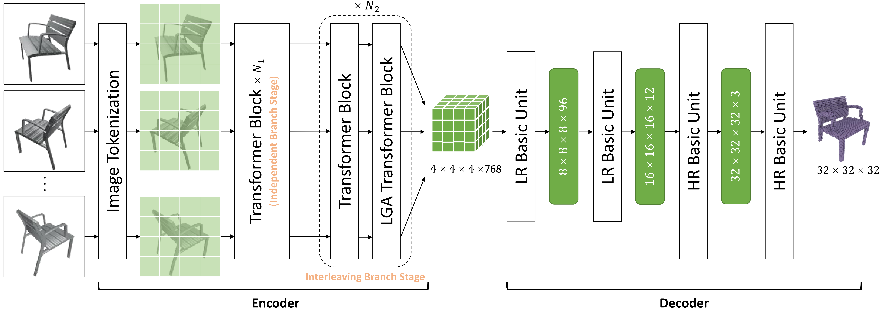

# Long-Range-Grouping-Transformer
Official PyTorch implementation of the paper: 

Long-Range Grouping Transformer for Multi-View 3D Reconstruction

**Authors**: 

# TODO
- [ ] Release the code

# Citation

If you find our code or paper useful in your research, please consider citing:

# Futher Information

Please check out other works on multi-view reconstruction from our group:
- [GARNet: Global-Aware Multi-View 3D Reconstruction Network and the Cost-Performance Tradeoff (Pattern Recognition 2023)](https://github.com/GaryZhu1996/GARNet)
