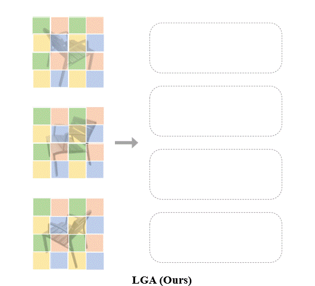
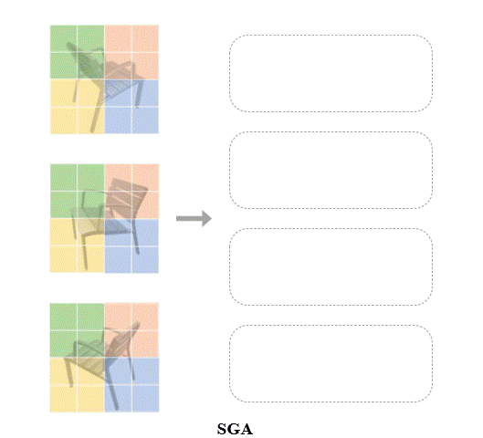
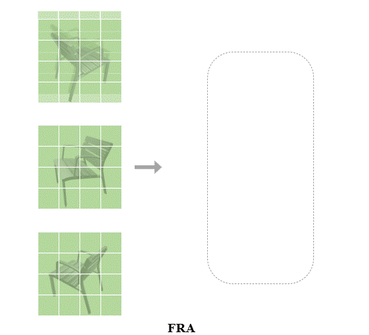
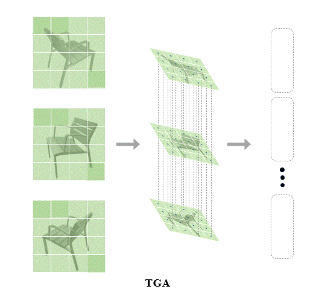

# Long-Range-Grouping-Transformer
Official PyTorch implementation of the paper: 

Long-Range Grouping Transformer for Multi-View 3D Reconstruction

**Authors**: Liying Yang, Zhenwei Zhu, Xuxin Lin, Jian Nong, Yanyan Liang.

 
 

## TODO
The code and pretrain models are coming soon.
- [ ] Release the pretrain models
- [ ] Release the code

## Installation

## Demo

## Datasets

We use the [ShapeNet](https://www.shapenet.org/) and [Pix3D](http://pix3d.csail.mit.edu/) in our experiments, which are available below:

- ShapeNet rendering images: http://cvgl.stanford.edu/data2/ShapeNetRendering.tgz
- ShapeNet voxelized models: http://cvgl.stanford.edu/data2/ShapeNetVox32.tgz
- Pix3D images & voxelized models: http://pix3d.csail.mit.edu/data/pix3d.zip

## Get start

### Training

### Evaluation

## Citation

If you find our code or paper useful in your research, please consider citing:

## Futher Information

Please check out other works on multi-view reconstruction from our group:
- [GARNet: Global-Aware Multi-View 3D Reconstruction Network and the Cost-Performance Tradeoff (Pattern Recognition 2023)](https://github.com/GaryZhu1996/GARNet)
- [UMIFormer: Mining the Correlations between Similar Tokens for Multi-View 3D Reconstruction (ICCV 2023)](https://github.com/GaryZhu1996/UMIFormer)
